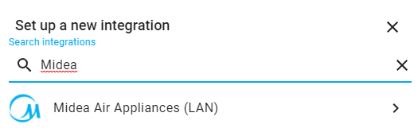
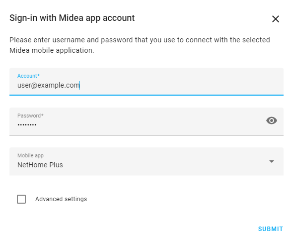
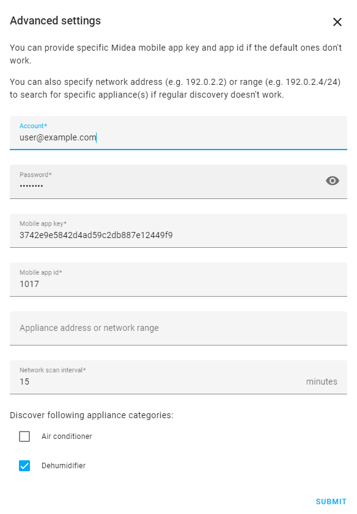
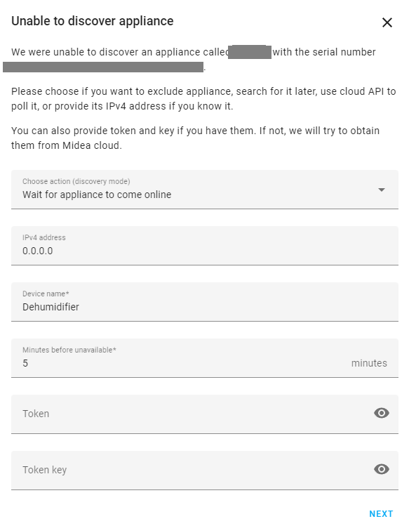

[![GitHub Release][releases-shield]][releases]
[![GitHub Activity][commits-shield]][commits]
[![License][license-shield]][license]

[![hacs][hacsbadge]][hacs]
[![Project Maintenance][maintenance-shield]][user_profile]

![Midea Brands][logos]

_Adds support for Midea dehumidifer appliances via local network_

**This component will set up the following entities.**

Platform | Description
-- | --
`humidifier` | Dehumidifier entity. Four modes are supported: `Set`, `Continous`, `Smart` and `Dry`.
`fan` | Fan entity for controlling dehumidifer fan. Three preset modes are available `Silent`, `Medium` and `Turbo`. Switching fan off sets `Silent` preset and switching on sets `Medium` preset.
`binary_sensor` | Problem sensor indicating when tank is full.
`binary_sensor` | Problem sensor indicating when filter needs replacement (_disabled by default_).
`binary_sensor` | Cold sensor indicating defrosting is active (_disabled by default_).
`sensor` | Sensors for current relative humidity measured by dehumidifier.
`sensor` | Sensor for current temperature measured by dehumidifier.
`switch` | Switch ION mode on and off (_disabled by default_)
`switch` | Switch pump on and off (_disabled by default_)
`switch` | Switch sleep mode on and off (_disabled by default_)


## Installation

1. Click install.
1. In the HA UI go to "Configuration" -> "Integrations" click "+" and search for "Midea Dehumidifier (LAN)".



## Configuration

[![Add Midea Dehumidifier (LAN)][add-integration-badge]][add-integration]
* or search for "Midea Dehumidifier (LAN)"

* Sign-in with Midea app account - you may choose Midea app that corresponds to one you use (anyone should work).

* On advanced options dialog you may enter another application key if you want, specify a network range to be used for discovery or choose to rely on cloud polling. If you don't specify network range, the integration will scan all local network interfaces.

* For devices that are known to cloud service, but not discovered localy, you will have another prompt to enter details if you know them or to specify that you want to rely on cloud polling for that device.

***

[commits-shield]: https://img.shields.io/github/commit-activity/y/nbogojevic/midea-dehumidifier-lan.svg?style=for-the-badge
[commits]: https://github.com/nbogojevic/midea-dehumidifier-lan/commits/master
[hacs]: https://hacs.xyz
[hacsbadge]: https://img.shields.io/badge/HACS-Custom-orange.svg?style=for-the-badge
[forum-shield]: https://img.shields.io/badge/community-forum-brightgreen.svg?style=for-the-badge
[forum]: https://community.home-assistant.io/
[license]: https://github.com/nbogojevic/midea-dehumidifier-lan/blob/main/LICENSE
[license-shield]: https://img.shields.io/github/license/nbogojevic/midea-dehumidifier-lan.svg?style=for-the-badge
[maintenance-shield]: https://img.shields.io/badge/maintainer-Nenad%20Bogojević-blue.svg?style=for-the-badge
[releases-shield]: https://img.shields.io/github/release/nbogojevic/midea-dehumidifier-lan.svg?style=for-the-badge
[releases]: https://github.com/nbogojevic/midea-dehumidifier-lan/releases

[user_profile]: https://github.com/nbogojevic
[logos]: assets/logos.png
[add-integration]: https://my.home-assistant.io/redirect/config_flow_start?domain=midea_dehumidifier_lan
[add-integration-badge]: https://my.home-assistant.io/badges/config_flow_start.svg

[dehumidifier-details]: assets/dehumidifier-details.png
